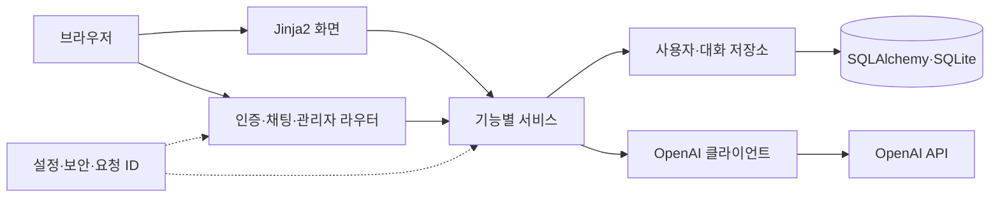

# 사용자별 AI 챗봇

## 프로젝트 소개

FastAPI, SQLite, OpenAI API를 통합한 로그인 기반 챗봇입니다. 사용자별 대화 문맥과 기록을 분리하고 응답 성공·실패 상태를 저장하며 관리자에게 운영 메타데이터를 제공합니다.

## 핵심 특징

- 회원가입·로그인·서명된 세션과 관리자 권한 검사
- 최근 성공 대화 최대 5건을 사용하는 질문 응답
- 사용자 소유권을 조건으로 하는 대화 기록 조회
- 질문·답변·실패 상태와 요청 추적 ID 저장
- 관리자 전용 읽기 화면과 민감정보를 제외한 메타데이터
- 기존 테스트, Ruff·Pyright, 잠금 파일 기반 환경 재현

## 아키텍처

하나의 FastAPI 프로세스에서 기능별 모듈을 분리합니다. 기본 의존 방향은 `라우터 → 서비스 → 저장소 → 공통 기반`입니다. 브라우저는 Jinja2 화면과 채팅 JSON API를 사용하고, 서버가 OpenAI API에 요청합니다.

| 경로 | 역할 |
| --- | --- |
| `src/chatbot/main.py` | 앱 생성·미들웨어·라우터·초기화·상태 확인 |
| `src/chatbot/core/` | 설정·DB·보안·요청 ID |
| `src/chatbot/auth/` | 사용자·인증·권한·초기 관리자 |
| `src/chatbot/chat/` | 대화 문맥·AI 호출·기록 저장·JSON API |
| `src/chatbot/admin/` | 관리자 전용 운영 조회 |
| `src/chatbot/ui/` | 화면 라우터·템플릿·정적 자산 |
| `tests/` | 기존 단위·통합·계약 검증 |
| `docs/spec/` | 구조·API·DB·AI·UI·배포 계약 |



소스는 `src/chatbot/`, 회귀 테스트는 `tests/`, 개발 보조 도구는 `scripts/`에 둡니다. `pyproject.toml`이 패키지·명령·개발 도구를 선언하고 `uv.lock`이 설치 버전을 고정합니다. `uv sync --frozen`은 소스를 개발 모드로 설치하므로 앱 실행과 테스트에 별도 `PYTHONPATH` 설정이 필요하지 않습니다.

## 실행 환경과 시작하기

Python 3.11 이상과 uv가 필요합니다. `.python-version`은 개발 기준 버전 3.13을 지정합니다. 저장소 루트에서 실행합니다.

```bash
uv sync --frozen
cp .env.example .env
```

`.env`의 `SESSION_SECRET`을 채우고, 관리자 계정이 없는 DB의 첫 실행에는 `ADMIN_INITIAL_PASSWORD`를 지정합니다. 채팅을 사용할 때 `OPENAI_API_KEY`가 필요합니다.

| 변수 | 설명 |
| --- | --- |
| `SESSION_SECRET` | 필수 세션 서명 비밀값 |
| `ADMIN_INITIAL_PASSWORD` | 초기 관리자 생성 시 필수 비밀번호 |
| `OPENAI_API_KEY` | AI 요청에 필요한 서버 인증 키 |
| `OPENAI_MODEL` | 기본값 `gpt-5-nano` |
| `OPENAI_TIMEOUT_SECONDS` | 기본값 30초 |
| `DATABASE_URL` | 로컬 기본값 `sqlite:///./data/chatbot.db` |
| `APP_ENV` | `local` 또는 `production` |
| `LOG_LEVEL`, `ADMIN_USERNAME` | 기본값 `INFO`, `admin` |
| `PORT` | 배포 시 지정하는 HTTP 포트 |

```bash
uv run --frozen uvicorn chatbot.main:app --reload
```

기본 접속 주소는 `http://127.0.0.1:8000`입니다. `/signup`·`/login`에서 시작하고 `GET /health`로 `{"status":"ok"}`를 확인합니다.

## 주요 경로와 데이터

| 경로 | 기능 |
| --- | --- |
| `/signup`, `/login`, `/logout` | 인증 폼·세션 관리 |
| `/chat` | 본인 채팅 화면 |
| `POST /api/chat` | 질문 처리 |
| `GET /api/chat-exchanges` | 본인 기록 목록 |
| `GET /api/chat-exchanges/{chat_exchange_id}` | 본인 단일 기록 |
| `/admin/logs` | 관리자 운영 기록 |
| `/health` | 프로세스 상태 확인 |

DB는 사용자와 대화 기록을 저장합니다. 비밀값은 서버 설정에서 읽으며 응답·브라우저 코드에 넣지 않습니다. 질문·답변 등 실제 대화 데이터의 보관과 백업은 운영자가 관리합니다.

## 검증

```bash
make check
make test
make smoke
make build
```

문서·문법·Ruff·Pyright와 기존 pytest 테스트를 실행합니다. 테스트의 AI 호출은 모의 객체로 확인하며 실제 API 요청 성공을 보장하지 않습니다. CI도 같은 잠금 파일과 검증 명령을 사용합니다.

`make check`는 정적 분석·포맷·문서 검사를, `make test`는 `uv run --frozen pytest -q`로 전체 동작 검사를 실행합니다. `make smoke`는 같은 테스트 중 `smoke` 마커가 붙은 실행 확인만 선택합니다(`uv run --frozen pytest -q -m smoke`). 테스트는 `test_*.py`와 fixture로 구성하며 임시 DB·파일과 모의 요청을 사용합니다.

## 배포와 상세 문서

운영 환경은 `APP_ENV=production`, 명시적 `DATABASE_URL`, 세션 비밀값, 관리자 설정이 필요합니다. Railway 예시는 SQLite 볼륨을 `/data`에 연결합니다. 세부 환경·실행·배포 조건은 [실행·배포 계약](docs/spec/DEPLOYMENT.md)을 따릅니다.

- [서비스 명세](docs/spec/SPEC.md), [아키텍처](docs/spec/ARCHITECTURE.md)
- [API](docs/spec/api/API.md), [DB](docs/spec/db/DB.md), [AI](docs/spec/ai/AI.md), [UI](docs/spec/ui/UI.md)
- [Git 규칙](docs/rules/git-rules.md), [GitHub 규칙](docs/rules/github-rules.md)
